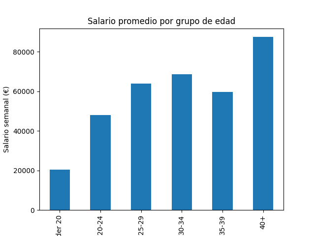
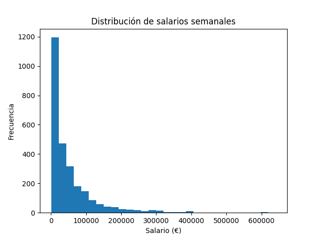
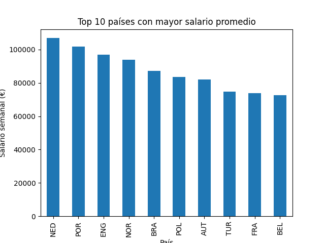

# Football Salary Analysis
Análisis de salarios de jugadores de fútbol utilizando Python y técnicas de análisis de datos.

## 📊 Descripción del proyecto
Este proyecto analiza los salarios de jugadores de fútbol profesional, con el objetivo de identificar patrones clave relacionados con:

- Posición en el campo
- Nacionalidad
- Equipos
- Edad
- Distribución salarial

El análisis fue realizado utilizando Python (Pandas, Matplotlib) y técnicas de limpieza de datos reales.

## 🧹 Limpieza de datos

Se realizaron las siguientes transformaciones:

- Selección de variables relevantes
- Extracción del salario en euros desde texto complejo
- Eliminación de valores nulos en nacionalidad
- Creación de variables:
  - Position_group
  - Nation_clean
  - Age_group
- Manejo de valores faltantes en posiciones

## 📊 Visualizaciones

### Edad vs salario

### Distribución salarial

### Top equipos

## 📈 Análisis realizado

### ⚽ Salario por posición
Los delanteros presentan el mayor salario promedio, lo que sugiere una mayor valorización del impacto ofensivo.

### 🌍 Salario por país
Tras filtrar países con baja representatividad, Países Bajos lidera en salario promedio.

### 🏆 Equipos con mayores salarios
Real Madrid, Bayern Munich y Manchester City encabezan el ranking, reflejando su poder financiero.

### 📈 Edad vs salario
Los jugadores entre 25 y 34 años concentran los salarios más altos, coincidiendo con el prime profesional.

### 📊 Distribución salarial
La distribución presenta asimetría positiva (sesgo a la derecha), evidenciando desigualdad salarial.

## 🛠️ Tecnologías utilizadas

- Python
- Pandas
- Matplotlib
- Jupyter Notebook
